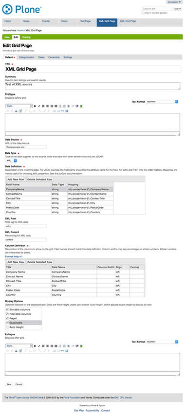
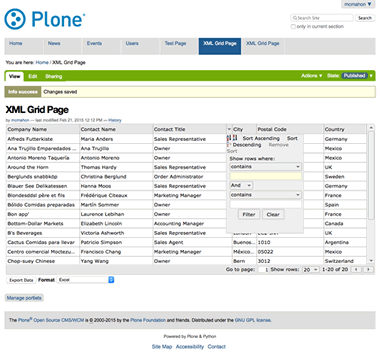

========================
collective.jqxgrid_pages
========================

Uses the jQWidgets jqxgrid library to represent data from a remote source in a grid.

This package does two things:

1) It adds the jqxGrid library and its dependencies to the Plone resource registries. jqxGrid is a very large resource, approximately 1MB in size. The library and its associated css is only loaded for grid pages.

2) Adds a Grid Page content type that allows you to specify a remote source, define incoming data, and title and format grid columns. Viewing the page will display a grid built from the specifications.

A note on sources: data is loaded via AJAX functions that are generally limited to the same server source as the displayed page. JSONP format avoids this problem, but requires that the remote source be able to do JSONP padding.

Portions of jQWidgets are included with this package and are licensed under the `Creative Commons Attribution-NonCommercial 3.0 License <http://creativecommons.org/licenses/by-nc/3.0/>`_.

If you wish to use this package commercially, you must obtain a commercial license.
See http://www.jqwidgets.com/license/.

Python and XML components are licensed under the GPL, v 2.

The development of this package was sponsored by the University of California Division of Social Sciences.

Example
=======

Try the following JSONP example:

Data source: http://jsonplaceholder.typicode.com/posts

Data type: JSONP

Data definition::

    userId, string
    id, string
    title, string
    body, string

Column definition::

    User Id, userId
    ID, id
    Title, title
    Body, body

